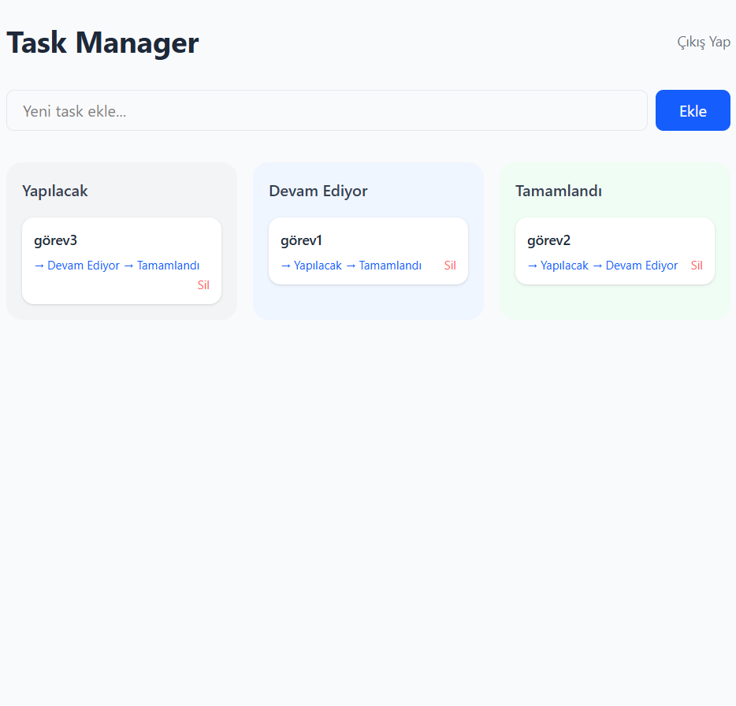

# Task Manager

Full-stack görev yönetimi uygulaması. Kullanıcılar kayıt olup giriş yapabilir, görev oluşturabilir ve görevleri Kanban board üzerinde yönetebilir.

## Özellikler

- Kullanıcı kaydı ve girişi (JWT authentication)
- Görev oluşturma, düzenleme ve silme
- Kanban board (Yapılacak / Devam Ediyor / Tamamlandı)
- Kullanıcıya özel görev yönetimi

## Teknolojiler

**Frontend**
- React + Vite
- Tailwind CSS
- Axios

**Backend**
- Python + FastAPI
- SQLAlchemy + SQLite
- JWT (python-jose)

## Kurulum

### Backend

```bash
cd backend
python -m venv venv
venv\Scripts\activate
pip install -r requirements.txt
uvicorn app.main:app --reload
```

### Frontend

```bash
cd frontend
npm install
npm run dev
```

## Kullanım

1. `http://localhost:8000` — Backend API
2. `http://localhost:8000/docs` — API dokümantasyonu
3. `http://localhost:5173` — Frontend

## Ekran Görüntüleri



